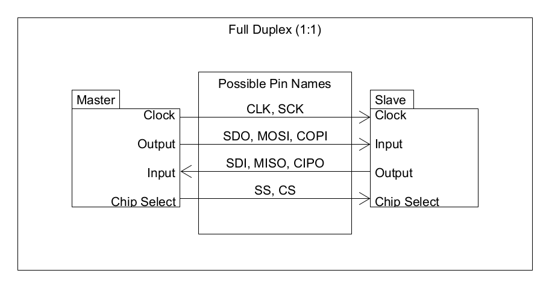

# Protocoles de communication
## SPI (Serial Peripheral Interface)
### Nomenclature
#### PINS
##### Clock
| Nom   | Signification |
| ----- | ------------- |
| CLK   | Clock         |
| SCK   | Serial Clock  |

##### Data Transfer (Full-Duplex)
###### Output
| Nom   | Signification                |
| ----- | ---------------------------- |
| SDO   | Serial Data Out              |
| MOSI  | Master Out Slave In          |
| COPI  | Controller Out Peripheral In |

###### Input
| Nom   | Signification                |
| ----- | ---------------------------- |
| SDI   | Serial Data In               |
| MISO  | Master In Slave Out          |
| CIPO  | Controller In Peripheral Out |

##### Data Transfer (Half-Duplex)
| Nom   | Signification      |
| ----- | ------------------ |
| SIO   | Serial In/Out      |
| SDIO  | Serial Data In/Out |

##### Chip Select
| Nom     | Signification |
| -----   | ------------- |
| CS      | Chip Select   |
| SS/SSEL | Slave Select  |

#### Modes
| Nom   | Signification  |
| ----- | -------------- |
| CPOL  | Clock Polarity |
| CPHA  | Clock Phase    |

### Modes d'opération (Configuration des pins)
#### Full-Duplex (1:1)

#### Half-Duplex

#### Full-Duplex (1:n)

# Composantes utilisées
## Spécifications
### Fiche techniques
- Télecom : [XBEE](https://www.digi.com/resources/documentation/digidocs/pdfs/90002173.pdf "XBEE Datasheet")
- Accéléromètre/Gyroscope/Magnétomètre : [Adafruit_TDK_InvenSense](https://learn.adafruit.com/adafruit-tdk-invensense-icm-20948-9-dof-imu/overview "Adafruit TDK InvenSense Datasheet")
- Altimètre/Thermomètre : [BMP388](https://www.bosch-sensortec.com/media/boschsensortec/downloads/datasheets/bst-bmp388-ds001.pdf "BMP388 Datasheet")
- GPS : 
### Communication
#### Protocoles supportés
| Type                       | Nom                     | I2C   | UART   | SPI   | RS-232   |
| -------------------------- | ----------------------- | :---: | :----: | :---: | :------: |
| Telecomunication           | XBEE                    |       | X      | X     |          |
| Acceléro/Gyro/Magnétomètre | Adafruit TDK InvenSense | X     |        | X     |          |
| Altimètre/Thermomètre      | BMP388                  | X     |        | X     |          |
| GPS                        |                         |       |        |       |          |