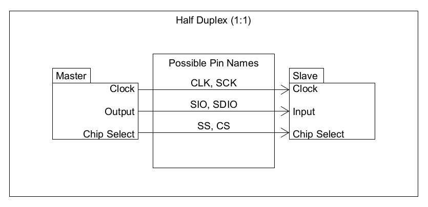

# Overview
## [Components](#components)
### - [Specs](#specs)
### - [Communication](#communication)
## [Communication-Protocols](#communication-protocols)
### - [SPI-(Serial-Peripheral-Interface)](#spi-serial-peripheral-interface)

# Components
## Specs
### Datasheets
- Telecom : [XBEE](https://www.digi.com/resources/documentation/digidocs/pdfs/90002173.pdf "XBEE Datasheet")
- Accelerometer/Gyroscope/Magnetometer : [Adafruit_TDK_InvenSense](https://invensense.tdk.com/wp-content/uploads/2016/06/DS-000189-ICM-20948-v1.3.pdf "Adafruit TDK InvenSense Datasheet")
- Altimeter/Thermometer : [BMP388](https://www.bosch-sensortec.com/media/boschsensortec/downloads/datasheets/bst-bmp388-ds001.pdf "BMP388 Datasheet")
- GPS : [BN-220](https://files.banggood.com/2016/11/BN-220%20GPS+Antenna%20datasheet.pdf "BN-220 Datasheet")
### Communication
#### Supported Protocols
| Type                       | Nom                     | I2C   | UART   | SPI   | NMEA 0183 |
| -------------------------- | ----------------------- | :---: | :----: | :---: | :------:  |
| Telecomunication           | XBEE                    |       | X      | X     |           |
| Accelero/Gyro/Magnetometer | Adafruit TDK InvenSense | X     |        | X     |           |
| Altimeter/Thermometer      | BMP388                  | X     |        | X     |           |
| GPS                        | BN-220                  |       |        |       | X         |

# Communication Protocols
## SPI (Serial Peripheral Interface)
### Nomenclature
#### PINS
##### Clock
| Name  | Meaning       |
| ----- | ------------- |
| CLK   | Clock         |
| SCK   | Serial Clock  |

##### Data Transfer (Full-Duplex)
###### Output
| Name  | Meaning                      |
| ----- | ---------------------------- |
| SDO   | Serial Data Out              |
| MOSI  | Master Out Slave In          |
| COPI  | Controller Out Peripheral In |

###### Input
| Name  | Meaning                      |
| ----- | ---------------------------- |
| SDI   | Serial Data In               |
| MISO  | Master In Slave Out          |
| CIPO  | Controller In Peripheral Out |

##### Data Transfer (Half-Duplex)
| Name  | Meaning            |
| ----- | ------------------ |
| SIO   | Serial In/Out      |
| SDIO  | Serial Data In/Out |

##### Chip Select
| Name    | Meaning       |
| -----   | ------------- |
| CS      | Chip Select   |
| SS/SSEL | Slave Select  |

#### SPI Modes
| Name  | Meaning        |
| ----- | -------------- |
| CPOL  | Clock Polarity |
| CPHA  | Clock Phase    |

### Operating modes (Pin configuration)
#### Full-Duplex (1:1)

#### Half-Duplex

#### Full-Duplex (1:n)

## UART