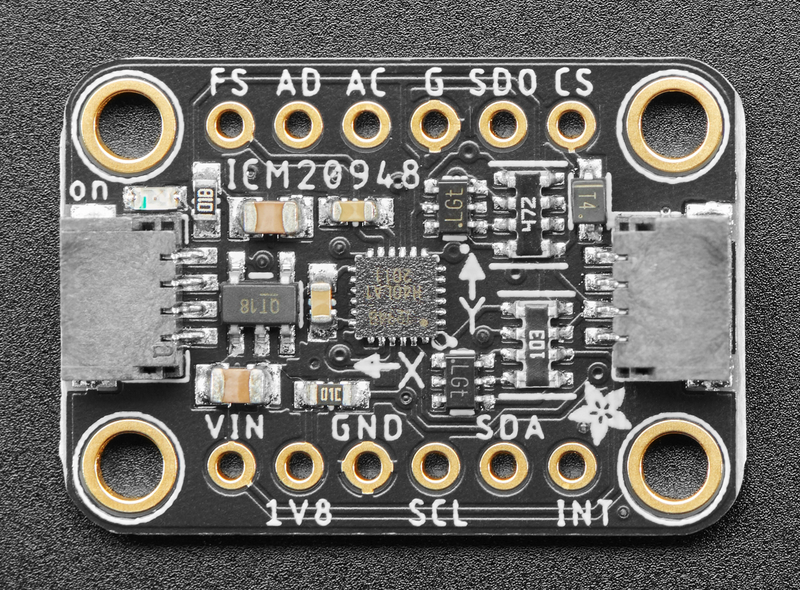

# Overview
## [Specs](#specs)
### - [Accelerometer](#accelerometer)
#### - [Rated values](#rated-values-3)
### - [Gyroscope](#gyroscope)
#### - [Rated values](#rated-values-4)
### - [Magnetometer](#magnetometer)
#### - [Rated values](#rated-values-5)
### - [Datasheet](https://invensense.tdk.com/wp-content/uploads/2016/06/DS-000189-ICM-20948-v1.3.pdf "Adafruit TDK InvenSense Datasheet")
## [Communication](#communication)
### - [Supported protocols](#supported-protocols)
### - [I2C](#i2c)
#### - [Address](#base-address)
#### - [Pinout](#pinout)

# Specs
## Accelerometer
### Rated Values
Acceleration : can be adjusted to the following ranges (± 2, 4, 8 or 16 g)
### Default values
When placed upon a flat surface, the accelerometer will display this :  
x : 0 g  
y : 0 g  
z : 1 g
## Gyroscope
### Rated Values
Rotation : can be programmed to the following ranges (± 250, 500, 1000 or 2000 rad/s)
## Magnetometer
### Rated Values
Magnetic field : ± 4900 μT
# Communication
## Supported protocols
| Protocol      | Supported |
| ------------- | :-------: |
| I2C           | X         |
| UART          |           |
| SPI           | X         |
## I2C
### Base address
I2C base address is 0x69.
### Pinout

| Pin Name | Role                                             |
| -------- | :----------------------------------------------: |
| VIN      | 3-5 VDC power pin (uses voltage regulator).      |
| GND      | Common ground for power and logic                |
| SCL      | Clock pin (Note : 10k pull-up on this pin)       |
| SDA      | Data pin (Note : 10k pull-up on this pin)        |
| SDO      | I2C address pin (if high goes from 0x69 to 0x68) |

NOTE : SCL and SDA both work with 3-5 VDC
### Advanced pinout
| Pin Name | Role                                        |
| -------- | :-----------------------------------------: |
| INT      | Primary interrupt pin                       |
| AC       | Auxiliary bus clock                         |
| AD       | Auxiliary bus data                          |

NOTE : Those work with 1.8 VDC only.

See [Adafruit TDK InvenSense Guide](https://learn.adafruit.com/adafruit-tdk-invensense-icm-20948-9-dof-imu/pinouts "Adafruit TDK InvenSense guide") for more informations about pinout.
